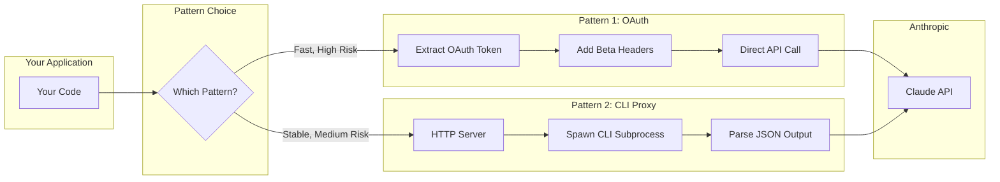
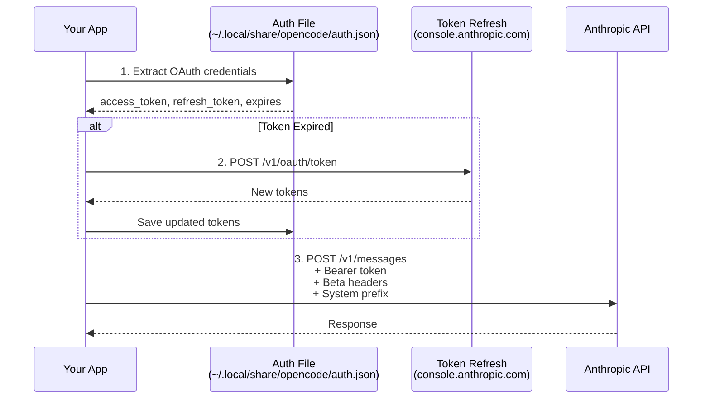
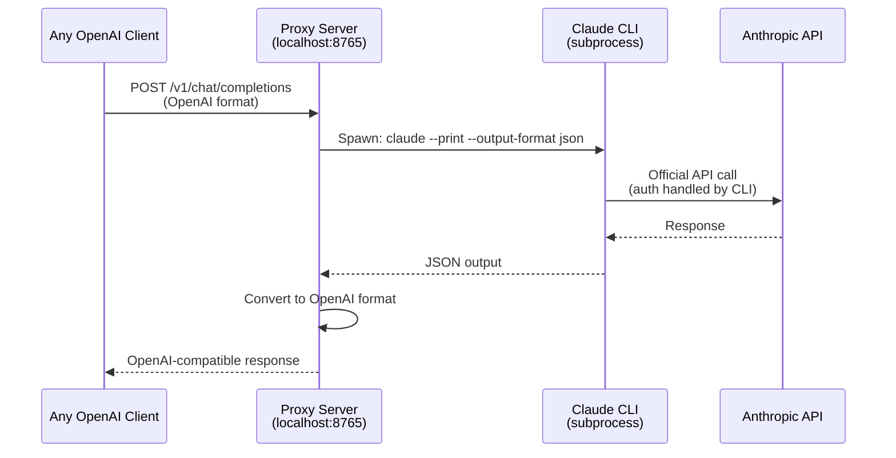
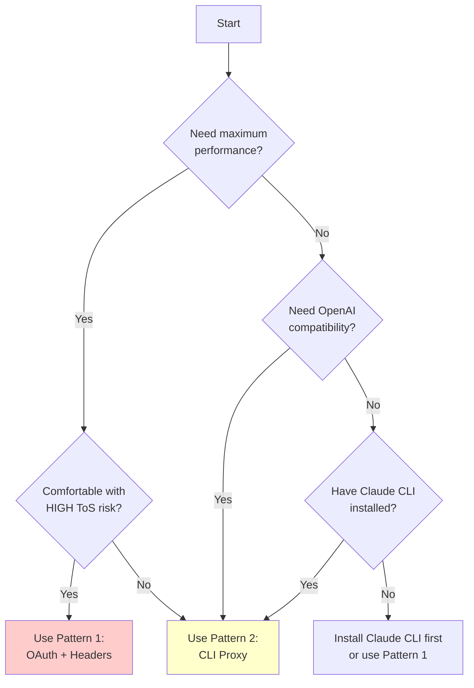

<div align="center">

# 🔌 Claude Subscription Bridge

**Educational Documentation for Programmatic Claude Access Patterns**

[](https://github.com/ShreeMulay/anthropic-subscription-optimization)
[](https://github.com/ShreeMulay/anthropic-subscription-optimization)
[](https://github.com/ShreeMulay/anthropic-subscription-optimization)

[](https://opensource.org/licenses/MIT)
[](https://python.org)
[](https://typescriptlang.org)

</div>

---

> [!CAUTION]
> ## ⚠️ CRITICAL LEGAL NOTICE
> 
> This documentation is for **EDUCATIONAL PURPOSES ONLY**. Using these methods may violate [Anthropic's Terms of Service](https://www.anthropic.com/legal/terms).
> 
> **RISKS INCLUDE:**
> - 🚫 **Immediate account suspension or termination**
> - 🚫 **Loss of access to ALL Claude services**
> - 🚫 **Potential legal action from Anthropic**
> 
> **This is NOT intended for:**
> - Commercial SaaS redistribution
> - Reselling access to Anthropic's services
> - Production applications
> 
> **By proceeding, you acknowledge these risks and accept full responsibility.**
> 
> See [LEGAL.md](./LEGAL.md) for detailed information.

---

## 📋 Table of Contents

- [⚠️ Legal Disclaimer](#-critical-legal-notice)
- [🔧 Prerequisites](#-prerequisites)
- [📖 Overview](#-overview)
- [💰 Economic Context](#-economic-context-why-this-matters)
- [🏗️ Pattern 1: OAuth + Beta Headers](#pattern-1-oauth-token--beta-headers)
- [🏗️ Pattern 2: CLI Proxy Server](#pattern-2-claude-cli-proxy-server)
- [🆚 Pattern Comparison](#-pattern-comparison)
- [🤔 Which Pattern Should I Use?](#-which-pattern-should-i-use)
- [🔒 Security Best Practices](#-security-best-practices)
- [📚 Existing Implementations](#-existing-implementations)
- [🤖 AI Prompts for Custom Implementation](#-ai-prompts-for-custom-implementation)
- [🔄 Failure Modes & Mitigations](#-failure-modes--mitigations)
- [📖 Further Reading](#-further-reading)
- [🤝 Contributing](#-contributing)

---

## 🔧 Prerequisites

Before proceeding, ensure you have:

### Required for Both Patterns
- ✅ **Active Claude Pro or Max subscription** ($20-200/month)
- ✅ **Claude Code CLI installed and authenticated** ([Installation Guide](https://docs.anthropic.com/en/docs/claude-code/getting-started))
- ✅ Understanding of OAuth 2.0 flows
- ✅ Basic HTTP/API knowledge

### For OAuth + Headers Pattern (Python)
```bash
pip install httpx  # or: uv pip install httpx
```

### For CLI Proxy Pattern (TypeScript/Bun)
```bash
curl -fsSL https://bun.sh/install | bash
bun --version  # Verify installation
```

### Verify Claude CLI Authentication
```bash
# Run this to confirm Claude CLI is working
claude --version
claude "Hello, world" --print
```

---

## 📖 Overview

This repository documents **two implementation patterns** for accessing Anthropic Claude models using your Claude Max/Pro subscription programmatically, instead of the pay-per-token API.



---

## 💰 Economic Context: Why This Matters

<details>
<summary><b>📊 Expand: The Economic Context (The "Buffet Analogy")</b></summary>

### The Pricing Problem

Anthropic offers two pricing models—think of it like ordering à la carte vs. an all-you-can-eat buffet:

| Model | API (Pay-Per-Token) | Claude Max Subscription |
|-------|---------------------|-------------------------|
| Claude Opus 4.5 | $15/M input, $75/M output | Unlimited* (flat monthly fee) |
| Claude Sonnet 4.5 | $3/M input, $15/M output | Unlimited* (flat monthly fee) |

*Within fair use policy

### Real-World Impact

For a developer working extensively with Claude:

| Metric | Value |
|--------|-------|
| **Monthly Usage** | ~10M tokens (typical heavy usage) |
| **API Cost** | ~$150-450/month |
| **Subscription Cost** | $20-200/month |
| **Potential Savings** | **5-20x** |

> *"In a month of Claude Code, it's easy to use so many LLM tokens that it would have cost you more than $1,000 if you'd paid via the API."*
> — Hacker News Discussion, January 2026

</details>

---

## Pattern 1: OAuth Token + Beta Headers

> [!WARNING]
> **ToS Risk: HIGH** — This pattern spoofs Claude Code identity. Use at your own risk.

A technique that extracts OAuth credentials from the official Claude Code CLI and uses them to make direct API calls.

### Architecture



### Key Components

**1. OAuth Token Extraction**

```python
from pathlib import Path
import json
from typing import Optional

# Claude Code stores auth in these locations
OPENCODE_AUTH_PATHS = [
    Path.home() / ".local" / "share" / "opencode" / "auth.json",
    Path.home() / ".opencode" / "data" / "auth.json",
    Path.home() / ".config" / "opencode" / "auth.json",
]

def load_oauth_credentials() -> Optional[dict]:
    """Extract OAuth credentials from Claude Code auth file."""
    for auth_path in OPENCODE_AUTH_PATHS:
        if auth_path.exists():
            data = json.loads(auth_path.read_text())
            anthropic_auth = data.get("anthropic", {})
            if anthropic_auth.get("type") == "oauth":
                return {
                    "access": anthropic_auth.get("access"),
                    "refresh": anthropic_auth.get("refresh"),
                    "expires": anthropic_auth.get("expires", 0),
                    "auth_path": auth_path,
                }
    return None
```

**2. Token Refresh**

```python
import httpx
import time

async def refresh_oauth_token(refresh_token: str) -> Optional[dict]:
    """Refresh expired OAuth token."""
    async with httpx.AsyncClient() as client:
        response = await client.post(
            "https://console.anthropic.com/v1/oauth/token",
            json={
                "grant_type": "refresh_token",
                "refresh_token": refresh_token,
                "client_id": "<CLIENT_ID_FROM_OFFICIAL_APP>",
            },
        )
        if response.is_success:
            data = response.json()
            return {
                "access": data.get("access_token"),
                "refresh": data.get("refresh_token"),
                "expires": int(time.time() * 1000) + data.get("expires_in", 3600) * 1000,
            }
    return None
```

**3. Identity Spoofing Headers**

```python
# These headers tell Anthropic "I am Claude Code CLI"
CLAUDE_CODE_BETA_FLAGS = (
    "oauth-2025-04-20,"
    "claude-code-20250219,"
    "interleaved-thinking-2025-05-14,"
    "fine-grained-tool-streaming-2025-05-14"
)

# System prompt MUST start with this prefix
CLAUDE_CODE_SYSTEM_PREFIX = "You are Claude Code, Anthropic's official CLI for Claude."

def build_headers(access_token: str) -> dict:
    return {
        "authorization": f"Bearer {access_token}",
        "anthropic-version": "2023-06-01",
        "anthropic-beta": CLAUDE_CODE_BETA_FLAGS,
        "content-type": "application/json",
    }
```

### Pattern 1: Pros/Cons

| ✅ Pros | ❌ Cons |
|---------|---------|
| No CLI dependency required | Needs OAuth extraction logic |
| Direct API calls (fastest) | Tokens expire, need refresh |
| Fallback to API key possible | **HIGH ToS violation risk** |
| Works with any HTTP client | OAuth endpoints may change |

---

## Pattern 2: Claude CLI Proxy Server

> [!NOTE]
> **ToS Risk: MEDIUM** — Uses official CLI, technically a wrapper.

A technique that spawns the official Claude Code CLI as a subprocess and wraps it in an OpenAI-compatible HTTP API.

### Architecture



### Key Components

**1. Spawn Claude CLI Subprocess**

```typescript
async function spawnClaude(prompt: string, system?: string): Promise<ClaudeResponse> {
  const args = ['--print', '--output-format', 'json'];
  
  if (system) {
    args.push('--system-prompt', system);
  }
  args.push(prompt);

  const proc = Bun.spawn(['claude', ...args], {
    stdout: 'pipe',
    stderr: 'pipe',
  });

  const stdout = await new Response(proc.stdout).text();
  const stderr = await new Response(proc.stderr).text();
  const exitCode = await proc.exited;

  if (exitCode !== 0) {
    throw new Error(`Claude CLI failed: ${stderr}`);
  }

  return JSON.parse(stdout);
}

interface ClaudeResponse {
  type: 'result' | 'error';
  duration_ms: number;
  result: string;
  usage: {
    input_tokens: number;
    output_tokens: number;
  };
}
```

**2. OpenAI-Compatible HTTP Server**

```typescript
function convertToOpenAIFormat(claude: ClaudeResponse, model: string) {
  return {
    id: `chatcmpl-${Date.now()}`,
    object: 'chat.completion',
    created: Math.floor(Date.now() / 1000),
    model: model,
    choices: [{
      index: 0,
      message: { role: 'assistant', content: claude.result },
      finish_reason: claude.type === 'error' ? 'error' : 'stop',
    }],
    usage: {
      prompt_tokens: claude.usage.input_tokens,
      completion_tokens: claude.usage.output_tokens,
      total_tokens: claude.usage.input_tokens + claude.usage.output_tokens,
    },
  };
}

const server = Bun.serve({
  port: 8765,
  async fetch(req) {
    const url = new URL(req.url);
    
    if (url.pathname === '/health') {
      return Response.json({ status: 'ok' });
    }
    
    if (url.pathname === '/v1/chat/completions' && req.method === 'POST') {
      const body = await req.json();
      const prompt = body.messages.map((m: any) => `${m.role}: ${m.content}`).join('\n');
      
      const claudeResponse = await spawnClaude(prompt, body.system);
      return Response.json(convertToOpenAIFormat(claudeResponse, body.model));
    }
    
    return new Response('Not Found', { status: 404 });
  },
});

console.log(`Proxy running at http://localhost:${server.port}`);
```

**3. Run as Background Service**

```bash
# Using tmux
tmux new-session -d -s claude-proxy "bun run server.ts"

# Using systemd (Linux)
# Create /etc/systemd/system/claude-proxy.service

# Using Docker
docker run -d --name claude-proxy -p 8765:8765 your-image
```

### Pattern 2: Pros/Cons

| ✅ Pros | ❌ Cons |
|---------|---------|
| Uses official CLI (no spoofing) | Requires Claude CLI installed |
| Automatic auth handling | Subprocess overhead (~100ms) |
| Works with ANY OpenAI client | Slower than direct API |
| Lower ToS risk | CLI updates may break it |

---

## 🆚 Pattern Comparison

| Aspect | OAuth + Headers | CLI Proxy |
|--------|-----------------|-----------|
| **Setup Complexity** | Medium (OAuth flow) | Low (spawn CLI) |
| **Performance** | ⚡ Fast (direct API) | 🐢 Medium (subprocess) |
| **Stability** | 🔴 Low (beta flags change) | 🟡 Medium (CLI updates) |
| **Auth Handling** | Manual (refresh logic) | Automatic (CLI handles) |
| **ToS Risk** | 🔴 **HIGH** (spoofing) | 🟡 **MEDIUM** (wrapper) |
| **Best For** | Maximum performance | Stability & safety |

---

## 🤔 Which Pattern Should I Use?



**Quick Decision:**
- 🏎️ **Need speed + accept high risk?** → Pattern 1 (OAuth)
- 🛡️ **Prefer stability + lower risk?** → Pattern 2 (CLI Proxy)
- 🔌 **Need OpenAI API compatibility?** → Pattern 2 (CLI Proxy)

---

## 🔒 Security Best Practices

> [!IMPORTANT]
> **Never commit credentials to version control!**

### Token Storage
```bash
# ❌ BAD: Hardcoded paths
AUTH_FILE = "~/.local/share/opencode/auth.json"

# ✅ GOOD: Environment variables
import os
AUTH_FILE = os.environ.get("CLAUDE_AUTH_FILE", "~/.local/share/opencode/auth.json")
```

### Recommended Practices
- 🔐 Use environment variables for sensitive paths
- 🔐 Never commit `auth.json` to git (add to `.gitignore`)
- 🔐 Implement rate limiting to avoid detection
- 🔐 Monitor for API changes that might break implementations
- 🔐 Use secure storage (keyring, vault) for production

### `.gitignore` Template
```gitignore
# Auth files - NEVER commit these
auth.json
*.token
.env
.env.local
```

---

## 📚 Existing Implementations

These patterns are already implemented by various projects. **Review these for production-ready code:**

| Project | Pattern | Language | Notes |
|---------|---------|----------|-------|
| [horselock/claude-code-proxy](https://github.com/horselock/claude-code-proxy) | OAuth Proxy | Node.js | 67⭐, actively maintained |
| [mergd/ccproxy](https://github.com/mergd/ccproxy) | CLI Proxy | Go | Cursor-specific |
| [phrazzld/switchboard](https://github.com/phrazzld/switchboard) | Service Proxy | Python | Multi-provider |

> 💡 **Tip**: This documentation focuses on explaining *how* they work, not providing another implementation. Use the projects above for production code.

---

## 🤖 AI Prompts for Custom Implementation

Copy-paste these prompts to ask an AI (Claude, GPT-4, etc.) to build a custom implementation.

<details>
<summary><b>📋 Prompt: OAuth + Headers Pattern (Python)</b></summary>

```
I need you to build a Python module that implements the Anthropic Claude OAuth access pattern.

## Requirements

1. Extract OAuth credentials from Claude Code CLI auth file:
   - ~/.local/share/opencode/auth.json
   - ~/.opencode/data/auth.json  
   - ~/.config/opencode/auth.json

2. Implement automatic token refresh when expired (60s buffer)

3. Make API calls to anthropic.com/v1/messages with these headers:
   - authorization: Bearer {access_token}
   - anthropic-version: 2023-06-01
   - anthropic-beta: oauth-2025-04-20,claude-code-20250219,interleaved-thinking-2025-05-14,fine-grained-tool-streaming-2025-05-14

4. System prompt MUST start with: "You are Claude Code, Anthropic's official CLI for Claude."

5. Fallback to API key authentication if OAuth fails

## Technical Details
- Use httpx for async HTTP calls
- Token refresh: POST https://console.anthropic.com/v1/oauth/token
- Save updated tokens back to auth file

## Expected API
async def call_anthropic(model: str, prompt: str, system_prompt: Optional[str] = None) -> dict

Please provide complete, working code with proper error handling.
```
</details>

<details>
<summary><b>📋 Prompt: CLI Proxy Pattern (TypeScript/Bun)</b></summary>

```
I need you to build a Claude Code CLI proxy server that exposes an OpenAI-compatible API.

## Requirements

1. Create an HTTP server (port 8765) with endpoints:
   - GET /health - Health check
   - GET /v1/models - List available models
   - POST /v1/chat/completions - OpenAI-compatible chat

2. For /v1/chat/completions:
   - Accept OpenAI format: {model, messages, temperature, max_tokens, system}
   - Spawn 'claude' CLI: --print --output-format json [--system-prompt SYSTEM] PROMPT
   - Convert response to OpenAI format

3. Technologies:
   - Bun.serve() for HTTP server
   - Bun.spawn() for CLI subprocess
   - TypeScript for type safety

## Error Handling
- CLI failure → 500 error with stderr
- Invalid JSON → 500 error with debug info
- Timeout → 504 error

Please provide complete, working TypeScript code.
```
</details>

<details>
<summary><b>📋 Prompt: Multi-Language Implementation</b></summary>

```
Help me create implementations in multiple languages for both Claude subscription patterns:

## Languages
- Python (httpx)
- TypeScript/Bun
- Go (net/http)
- Rust (reqwest, tokio)

## For Each Language
- Complete, runnable code
- Dependencies file (requirements.txt, package.json, go.mod, Cargo.toml)
- Run command
- Test curl command
- Error handling

## Folder Structure
/pattern1-oauth/{python,typescript,go,rust}
/pattern2-cli-proxy/{python,typescript,go,rust}

Please provide production-ready implementations with proper error handling.
```
</details>

---

## 🔄 Failure Modes & Mitigations

| Failure | Detection | Mitigation |
|---------|-----------|------------|
| Token expired | `401 Unauthorized` | Auto-refresh with refresh token |
| Beta flags changed | `400/403` errors | Fallback to API key; check GitHub issues |
| CLI not found | Spawn error | Prompt user to install Claude CLI |
| CLI update breaks | JSON parse error | Version pinning, graceful degradation |
| Rate limit | `429 Too Many Requests` | Exponential backoff, request queue |
| Session expired | `401` after refresh | Re-authenticate via Claude CLI |

### Debugging Tips

```python
# Check if OAuth token is valid
import time
creds = load_oauth_credentials()
if creds:
    expires_at = creds["expires"] / 1000  # Convert ms to seconds
    if time.time() > expires_at:
        print("Token expired, needs refresh")
    else:
        print(f"Token valid for {(expires_at - time.time()) / 60:.1f} more minutes")
```

---

## 📖 Further Reading

### Official Documentation
- [Anthropic API Documentation](https://docs.anthropic.com/)
- [Claude Code GitHub](https://github.com/anthropics/claude-code)
- [OpenCode Documentation](https://opencode.ai/docs/)

### Community Discussions
- [Hacker News - Anthropic Crackdown (Jan 2026)](https://news.ycombinator.com/item?id=46578701)
- [VentureBeat Coverage](https://venturebeat.com/technology/anthropic-cracks-down-on-unauthorized-claude-usage-by-third-party-harnesses)

### Related Technologies
- [Model Context Protocol (MCP)](https://modelcontextprotocol.io/)
- [OpenRouter](https://openrouter.ai/) - API aggregation alternative
- [OpenCode](https://opencode.ai/) - AI-powered code editor

---

## 🤝 Contributing

Contributions welcome for:
- 📝 Additional language implementations
- 🐛 Bug fixes and error handling improvements  
- 📚 Documentation clarifications
- 🔄 Updates when Anthropic changes their APIs

### How to Contribute
1. Fork the repository
2. Create a feature branch
3. Make your changes
4. Submit a pull request

### Reporting Breakages
If a pattern stops working:
1. [Open an issue](https://github.com/ShreeMulay/anthropic-subscription-optimization/issues) with error logs
2. Include: pattern used, error message, Claude CLI version
3. Check if others have reported the same issue

---

## 📄 License

MIT License - **Educational use only.**

> This documentation is provided for learning purposes. Usage of these techniques may violate Anthropic's Terms of Service. **Users are responsible for their own compliance.**

---

## 🙏 Acknowledgments

- Community members who discovered and documented these patterns
- Maintainers of existing proxy implementations
- Anthropic for Claude and Claude Code

---

<div align="center">

**⚠️ Remember: Educational purposes only. Use responsibly.**

*Built for the community to understand, learn, and make informed decisions.*

**[⭐ Star this repo](https://github.com/ShreeMulay/anthropic-subscription-optimization) if it helped you!**

</div>
